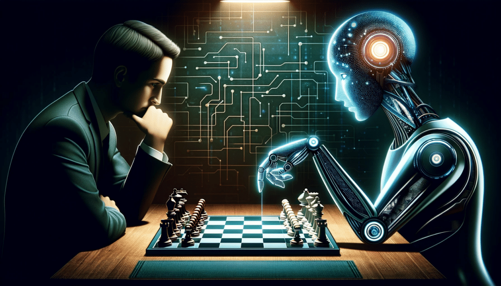

# **Projet Netflix-insights**

## Sommaire

- [**Projet Netflix-insights**](#projet-netflix-insights)
  - [Sommaire](#sommaire)
  - [**1** Présentation du projet](#1-présentation-du-projet)
    - [**1.1** L'équipe](#11-léquipe)
    - [**1.2** Contexte](#12-contexte)
      - [**1.2.1** Veille technologique](#121-veille-technologique)
      - [**1.2.2** Analyse exploratoire](#122-analyse-exploratoire)
    - [**1.3** Librairies utilisées](#13-librairies-utilisées)
  - [**2** Veille sur l'intelligence artificielle](#2-veille-sur-lintelligence-artificielle)
    - [**2.1** Définitions](#21-définitions)
      - [**A** Intelligence artificielle](#a-intelligence-artificielle)
      - [**B** Apprentissage automatique :](#b-apprentissage-automatique-)
      - [**C** Pré-traitement des données :](#c-pré-traitement-des-données-)
      - [**D** Analyse descriptive des données :](#d-analyse-descriptive-des-données-)
    - [**2.2** L'intelligence artificelle dans différents domaines](#22-lintelligence-artificelle-dans-différents-domaines)
      - [**A** La santé :](#a-la-santé-)
      - [**B** La finance :](#b-la-finance-)
      - [**C** La recherche :](#c-la-recherche-)
  - [**3** Analyse des données Netflix de septembre 2021](#3-analyse-des-données-netflix-de-septembre-2021)
    - [**3.1** Données utilisées](#31-données-utilisées)
    - [**3.2** Observations](#32-observations)
    - [**3.3** Conclusions](#33-conclusions)
  - [**4** Ressource](#4-ressource)

## **1** Présentation du projet
### **1.1** L'équipe
- Christian Aucane  

- Pierre Mazard  

- Léo Carrey  

### **1.2** Contexte
#### **1.2.1** Veille technologique
Voulant pousser notre apprentissage de l’intelligence artificielle, nous réalisons
une veille sur les différents aspects suivants :
- L’intelligence artificielle
- Le Machine Learning (ou l’apprentissage automatique)
- Le pré-traitement des données
- L’analyse descriptive des données

Nous expliquons également ce qu'il est possible de faire grâce a l'Intelligence Artificielle dans les domaines suivants :
- La santé
- La finance
- La recherche

#### **1.2.2** Analyse exploratoire
Netflix, géant mondial du divertissement, a transformé la façon dont nous
consommons les films et les émissions de télévision. Depuis sa création en
1997 en tant que service d'envoi de DVD par courrier, Netflix n'a cessé
d'évoluer, s'adaptant aux avancées technologiques et devenant finalement
la force dominante de l'industrie du streaming. Avec plus de 200 millions
d'abonnés dans le monde, Netflix offre une vaste bibliothèque de contenus
et propose des recommandations personnalisées, captivant les
spectateurs avec une expérience de streaming transparente.

Dans le cadre de notre formation en Bachelor IT, spécialité Intelligence Artificielle, nous nous lançons dans une étape importante de notre apprentissage, l’analyse de données !
Nous posons les premières fondations de celui-ci en répondant a une série de questions.

[**Lien vers les consignes**](https://drive.google.com/file/d/1blsg2xF8ND0hcU4PZ7d7o_Yakhf1Spd6/view?usp=drive_link)

### **1.3** Librairies utilisées
- 
- 
-  (pour NaN - **N**ot **a** **N**umber)
- Missingno
- NLTK
- Wordcloud

## **2** Veille sur l'intelligence artificielle

### **2.1** Définitions

#### **A** Intelligence artificielle

* ``Intelligence`` : 

Ensemble des processus trouvés dans des systèmes, plus ou moins complexes, vivant ou non, qui permettent d'apprendre, de comprendre ou de s'adapter à des situations nouvelles.

Le terme intelligence de la langue française est emprunté au latin intellĕgentĭa, lui-même dérivé du latin intellĕgō (« discerner, démêler, comprendre, remarquer ») dont le préfixe intĕr (« entre, parmi ») et le radical lĕgō (« ramasser, recueillir, choisir ») donnent le sens étymologique « choisir entre, ramasser parmi (un ensemble) » (ref : [Dictionnaire académie française](https://www.dictionnaire-academie.fr/article/A9I1608) / [wikipédia](https://fr.wikipedia.org/wiki/Intelligence))

* ``Artificiel`` : 

Qui est dû à la technique de l'homme, par opposition à ce qui a été crée et s'est développé naturellement. 

Le terme est emprunté du latin artificialis, "fait avec art, fait selon l'art". (ref: [Dictionnaire académie française](https://www.dictionnaire-academie.fr/article/A9A2706))

* ``Intelligence artificielle`` : 

L'**intelligence artificielle** est un ensemble de théories et de techniques visant à réaliser des machines capables de **simuler l'intelligence humaine**. (ref: [encyclopédie Larousse](https://www.larousse.fr/encyclopedie/divers/intelligence%20artificielle/187257))

Le terme, créé par **John McCarthy**, souvent abrégé par le sigle **IA** (**AI** en anglais), est définit par celui-ci ainsi : 

"_C'est la science et l'ingénierie de la fabrication de machines intelligentes, en particulier de programmes informatiques intelligents. Elle est liée à la tâche similaire qui consiste à utiliser des ordinateurs pour comprendre l'intelligence humaine, mais l'IA ne doit pas se limiter aux méthodes qui sont biologiqument observables._" (ref: [Article publié en 2004](https://www-formal.stanford.edu/jmc/whatisai.pdf))

Des décénies avant que cette définition ne soit donnée, la naissance de la conversatoin sur l'intélligence artificielle à été marquée par l'ouvrage fondateur d'**Alan Turing** publié en 1950, "[Computing Machinery and Intelligence](https://redirect.cs.umbc.edu/courses/471/papers/turing.pdf)". Dans cet article, M. Turing, souvent concidéré comme le père de l'informatique, propose la question suivante :

 "_Les machines peuvent-elles penser ?_".

Il propose ensuite un test, désormais connu sous le célèbre nom de "**Test de Turing**", dans lequel un interrogateur humain tente de différencier la réponse textuelle d'un ordinateur de celle d'un être humain. Bien que ce test ait fait l'objet d'un examen approfondi depuis sa publication, il reste un aspect important de l'histoire de l'IA ainsi qu'un concept permanent de la philosophie puisqu'il utilise des idées autour de la linguisitique. 

**Stuart Russel** et **Peter Norvig** ont ensuite publié [Intelligence artificielle : une approche moderne](https://aima.cs.berkeley.edu/), devenu l'un des principaux manuels d'étude de l'intelligence artificielle. Ils y explorent quatres objetcifs ou définitions potentiels de l'IA, qui différencient les systèmes informatiques sur la base de la rationalité et de la pensée par rapport à l'action : 
* **Approche humaine** : 
    * Des systèmes qui **pensent comme des humains** 
    * Des systèmes qui **agissent comme des humains**
* **Approche idéale** : 
    * Des systèmes qui **pensent de façon rationnelle**
    * Des systèmes qui **agissent de façon rationnelle**

La définition d'**Alan Turing** entrerait alors dans la catégorie des "**Systèmes qui agissent comme des humains**".

Dans sa forme la plus conscise, l'**IA est un domaine associant informatique à des ensembles de données fiables afin de faciliter la résolution de problèmes**.
Elle comprend égalment les sous-domaines du **marchine learning** et du **deep learning**, souvent utilisés en conjonction avec l'IA.
Ces diciplines sont constituées d'algorithmes d'IA cherchant à **créer des systèmes experts aboutissant à des prédictions ou des classifications** basées sur les **données entrantes**. (ref: [Qu'est ce que l'intélligence artificelle](https://www.ibm.com/fr-fr/topics/artificial-intelligence))

Pour l'**OCDE** (_Organisation de coopération et de développement économique_), un système d'IA est : 

" _un système basé sur une machine qui, pour des objectifs explicites ou implicites, déduit, à partir des informations qu'il reçoit, comment générer des résultats tels que des prédictions, du contenu, des recommandations ou des décisions, qui peuvent influencer les environnements physiques ou virtuels. Les différents systèmes d'IA varient dans leurs niveaux d'autonomie et d'adaptabilité après leur déploiement_" (ref: [Avis no 2024-01 du 17 janvier 2024 pour mieux encadrer l’usage de l’intelligence artificielle, CSNP, 21 p.](https://csnp.fr/wp-content/uploads/2024/01/AVIS-N%C2%B02024-01-du-17-JANVIER-2024-pour-mieux-encadrer-lusage-de-lintelligence-artificielle-2.pdf))

Il existe une confusion dans le débat publique entre **intelligence artificielle**, **aprentissage automatique** (_machine learning_) et **aprentissage profond** (_deep learning_). Pourtant ces notions ne sont pas équivalente, mais imbriquées. L'IA englobe l'aprentissage automatique, qui lui-même englobe l'aprentissage profond. (ref: [Intelligence artificielle, machine learning, deep learning : kézako ?](https://www.ledigitalab.com/2017/10/02/intelligence-artificielle-machine-learning-deep-learning-kezako/))

#### **B** Apprentissage automatique :

L'**apprentissage automatique** (_machine learning_), **apprentissage artificiel** ou **apprentissage statistique** est un champ d'étude de l'**intelligence artificiell** qui se fonde sur **des approches mathématiques et statistiques** pour donner aux ordinateurs la **capacité d'apprendre à partir de données**, c'est à dire d'**améliorer leurs performances à résoudre des tâches sans être explicitement programmées pour chacune.**

Plus largement, il concerne **la conception**, **l'analsyse**, **l'optimisation**, **le développement** et **l'implémentation** de telles méthodes.

On parle **d'aprprentissage statistique** car l'apprentissage consiste à **créer un modèle dont l'erreur _statistique moyenne_ est la plus faible possible**. 

L'**apprentissage automatique** comporte généralement deux phases : 

* **Estimer un modèle** à partir de données, appelées **observations**, qui sont disponibles et en nombre fini, lors de la phase de conception du système.
L'estimation du modèle consiste à **résoudre une tpache pratique**, telle que traduire un discrous, estimer une densité de probabilité, reconnaître la présence d'un chat dans une photographie ou participer à la ocnduite d'un véhicule autonome.
Cette **phase d'apprentissage ou d'entraînement** est généralement réalisée préalablement à l'utilisation pratique du modèle.

* **Mise en production**, le modèle étant déterminé, de **nouvelles données** peuvent alors être soumises afin d'**obtenir le résultat correspondant à la tâche souhaitée**.En pratique, certains systèmes peuvent pooursuivre leur apprentissage une fois en production, pour peu qu'ils aient un moyen d'obtenir un **retour sur la qualité des résultat produits**. (ref: [wikipédia](https://fr.wikipedia.org/wiki/Apprentissage_automatique))

En fonction des informarmations disponibles durant la phase d'apprentissage, l'apprentissage peut être qualifié de différentes façons : 

* [Apprentissage supervisé](https://fr.wikipedia.org/wiki/Apprentissage_supervis%C3%A9) : si **les données sont étiquetées** (la **réponse à la tâche est connue** pour ces données).

* [Classification ou classement](https://medium.com/le-blog-de-lapprentissage-automatique/quest-ce-que-la-classification-43744b75f546) : si **les étiquettes sont discrètes**.

* [Régression](https://fr.wikipedia.org/wiki/R%C3%A9gression_(statistiques)) : si **les étiquettes sont continues**.

    * Différence entre des variables discrètes et continues :

    Aspect | Varibales Discrète | Varibales Continues
    ---: | :---: | :---
    Sens | Espaces vides entre les valeurs | Séquence continues
    Nature | Dénombrable | Mesurable
    Valeurs | Valeurs distinctes ou séparées | Toute valeurs dans un intervalle
    Représentation graphique | Graphique à barres | Histogramme

* [Aprentissage par renforcement](https://fr.wikipedia.org/wiki/Apprentissage_par_renforcement) : Si le **modèle est appris de manière incrémentale en fonction d'une récompense reçue par le rpogramme pour chacune des actions entreprises**.

* [Apprentissage non supervisé](https://fr.wikipedia.org/wiki/Apprentissage_non_supervis%C3%A9) : Dans le cas le plus général, **sans étiquettes**, on cherche à **déterminer la structure sous-jacente des données** (pouvant être une densité de probabilité).

L'*apprentissage automatique** peut être appliqué à **différents types de données**, tels que des **graphes**, des **arbres**, des **courbes**, ou plus simplement des **vecteurs de caractéristiques**, pouvant être des variables **qualitatives** ou **quantitatives**, **continues** ou **discrètes**. 

#### **C** Pré-traitement des données :

Le **prétraitement des données** peut faire référence à la **manipulation** ou à la **suppression** de données **avant leur utilisation** afin d'**assurer** ou d'**améliorer** les performances, il s'agit d'une étape important du **processus d'exploration de données** et d'une des phases les plus importantes d'un projet d'**apprentissage automatique**.

L'idée dominante étant d'éviter, lors des méthodes de **collecte des données** souvent mal contrôlées, les valeurs hors limites, les combinaisons impossibles ou les valeurs manquantes. 

Le déroulement du **prétraitement des données** peut être décrit par les tâches suivantes :

* [Nettoyage](https://fr.abcdef.wiki/wiki/Data_cleansing) des données.
* [Edition](https://fr.abcdef.wiki/wiki/Data_editing) de données.
* [Réduction](https://fr.abcdef.wiki/wiki/Data_reduction) de données.
* [Dispute](https://fr.abcdef.wiki/wiki/Data_wrangling) de données. 

(ref : [https://fr.abcdef.wiki/wiki/Data_pre-processing])

#### **D** Analyse descriptive des données :

L'**analyse descriptive** est le **processus de transformation des données en informations**. 

Cela permet de prendre du recul et de comprendre ce qu'il s'est passé afin de prendre de meilleurs décisions.

Il s'agit d'un type d'analyse de données utilisé pour **décrire** et **comprendre** les données, permettant ainsi de comprendre les **modèles** et les **tendances** des données afin de prendre de meilleurs décisions. 

L'**analyse descriptive** est pafois confondue avec l'**analyse prédictive**, la première est utilisée pour répondre à la question "_qu'est ce qu'il s'est passé ?_, tandis ce que la seconde pour prédire ce qu'il se passera dans le futur. 

Il existe plusieurs types d'analyses descriptives, les plus courants étants :

* **L'analyse statistique** : Utilisée pour **comprendre ce q'il se passe dans un ensemble de données** et **trouver des relations entre différentes variables**.

* **La visualisation** : Utilisée pour **créer des graphiques et des diagrammes** permettant de **meixu comprendre les données**. Elle identifie les **tendances** et les **modèles** et met en lumière comment **les différentes variables agissent entre elles.**

* **Statistique descriptive** : Utilisées pour **résumer les données**, elles permettent de trouver la *moyenne**, la **médiane** et le **mode** d'un ensemble de données, ainsi que la **variance** et **l'écart type**.

* **Moyennes** : Utilisée dans le but de **fournir la valeur moyenne d'un ensemble de données**, elle permet de trouver la **moyenne**, la **médiane**, le **mode** et la **moyenne pondérée** d'un ensemble de données. 

(ref : [Analyse descriptive](https://timetodata.com/definitions/analyse-descriptive/))

### **2.2** L'intelligence artificelle dans différents domaines 

#### **A** La santé :

L'**intelligence artificielle dans la santé** est l'utilisation d'algorithmes et de logiciels pour s'approcher de la cognition humaine dans l'analyse de données médicales complexes. Plus précisément, l'IA dans ce domaine consiste en la **capacité des algorithmes informatiques à tirer des conclusions sans intervention humaine directe**.

=> L'objectif principal des applicaiton des IA dans le domaine dela santé est d'**analyser les relations entre, d'une part, la prévention ou les traitements et, d'autre part, l'état de santé des patients**.

Les programmes d'intelligence artificielle on été développés et appliqués à des pratiques telles que : 

* Le processus de **diagnostique**.
* L'élaboration d'un **protocole de traitement**.
* Le **développement de médicaments**.
* La **médecine personnalisée**.
* Les **soins** et le **suivi** des patients.

On peut les retrouver dans les domaines suivants : 

* **Radiologie**.
* **Psychiatrie**.
* **Cancérologie**.
* **Télésanté**.
* **Maladies chroniques et éducation thérapeutique**.
* **Indusrtrie**.

Bien que la recherche sur l'utilisation de l'IA dans les soins de santé tend à démontrer son efficacité dans l'*amélioration des résultats** pour le patient, son utilisation peut néanmoins introduire **plusieurs nouveaux types de problématiques** pour les patients et les fournisseurs de soins de santé, comme les [**biais algorithmiques**](https://fr.wikipedia.org/wiki/Biais_algorithmique) (Fait que le résultat d'un algorithme ne soit pas neutre, loyal ou équitable que ce soit de manière inconsciente ou délibérée), les question liées aux ordoannances de "ne pas réanimer", et d'autres questions de moralité des machines.
Ces défis posent la question d'un potentiel **besoin de réglementation**.

Depuis le début des années 2020, les **usages de l'IA et de l'apprentissge automatique** sont en pleinne expansion dans la pluspart des champs de la santé.
Cependant il faut s'attendre à des **dilemmes et défis éthiques complexes ou imprévus** sur les questions de **partialité**, de **protection des données et de la vie privée**, de l'**anonymat**, du **consentement éclairé**, de la **confidentialité et de la sécurité**, du **manque de transparence et d'explicabilité** ainsi que des **impacts potentiels sur les relations médecin-patient**...

Des **biais ([raciaux](https://www.emerald.com/insight/content/doi/10.1108/JICES-06-2018-0056/full/html) et [autres](https://aiej.org/aiej/article/view/1)) à l'empathie en passant par la compassion, l'IA suscite de **nombrux débats philosophiques, éthiques et moraux**.

Les **problèmes éthiques** de l'IA en général se croisent avec les **quatre piliers de l'héthique médicale** :

* L'**autonomie**.
* La **justice**.
* La **bienfaisance**.
* La **non-malfaisance**.

(ref : [Wikipedia](https://fr.wikipedia.org/wiki/Intelligence_artificielle_dans_la_sant%C3%A9))

#### **B** La finance :

L'**intelligence artificielle appliquée à la finance** consiste en l'utilisation de technologies, notamment d'algorithmes avancés et de machine learning, pour **analyser les données, automatiser les tâches et améliorer la prise de décision dans le secteur des services financiers**.

Il existe plusieurs **domaines d'application de l'IA dans le secteur financier** tel que : 

* **Trading algorithmique**.
* **Automatisation et efficacité**.
* **Avantage concurrentiel**.
* **Conformité**.
* **Evaluation du crédit**.
* **Réduction des coûts**.
* **Service client**.
* **Analyse des données**.
* **Détection des fraudes**.
* **Traitement des prêts**.
* **Finances personnelles**.
* **Gestion de portefeuilles**.
* **Analyse prédictive**.
* **Gestion des risques**.
* **Analyse des sentiments**.

Les **principaux acteurs de l'IA dans la finance** sont : 

* **Des auditeurs et équipes de contrôle internes.**
* **Des directeurs des systèmes d'information (DSI) et des directeurs techniques**.
* **Des clients**.
* **Des développeurs**.
* **Des responsables de l'éhtique et de la diversité**.
* **Des cadres**.
* **Des organismes financiers**.
* **Des équipes juridiques**.
* **Des équipes de gesition du risque**.

Dans le **cadre de la finance**, l'IA nécessite une **surveillance pour garentir une utilisation appropriée et un risque minimal**.
Une **gouvernance proactive** peut favoriser une **utilisation responsable**, **éthique** et **transparente** de l'IA, ce qui est essentiel lorsque les institutions financières traitents de **grandes quantités de données sensibles**.

(ref : [IBM](https://www.ibm.com/fr-fr/topics/artificial-intelligence-finance))

#### **C** La recherche :

L'**IA à considérablement transformée la recherche scientifique**.

Avec ses **capacités avancées en matière de traitement des données, d'apprentissage automatique et d'analyse prédictives**, l'IA offre des opportunités sans précédent pour **accélérer les découvertes scientifiques**.

Des domaines tels que la **biologie**, la **physique**, la **chimie** et bien d'autres bénéficient des avantages de l'IA. Cela permet aux chercheurs d'**explorer des questions coplexes** et de **résoudre des problèmes auparavant insolubles**.

Cette avancée technologique prometteuse ouvre de **nouvelles perspectives** passionnantes pour l'avenir de la recherche scientifique et offre des possiblitiés de progès révolutionnaires.

(ref : [lebigdata](https://www.lebigdata.fr/ia-recherche-scientifique))

## **3** Analyse des données Netflix de septembre 2021

### **3.1** Données utilisées
- Nom du fichier : `netflix_titles.csv`
- **8807** observations
- **Colonnes** :
  - `show_id` : Identifiant unique - str
  - `type` : Type d'oeuvre - str
    - **Movie** : Film
    - **TV Show** : Série
  - `title` : Titre de l'oeuvre - str
  - `director` : Rélisateur(s) - str
  - `cast` : Acteurs principal(aux) - str
  - `country` : Pays ayant produit l'oeuvre - str
  - `date_added` : Date d'ajout au catalogue Netflix - DateTime
  - `release_year` : Date de sortie de l'oeuvre - float(pour ne pas qu'il y ai d'erreur avec les valeurs manquantes)
  - `rating` : Classification d'age addociée a l'oeuvre - str
    - **PG-13** : Parental guidance suggérée - Certaines images peuvent ne pas convenir aux enfants de moins de 13 ans.
    - **TV-MA** : Mature Audience - Ce programme est destiné à un public adulte et peut ne pas convenir aux spectateurs de moins de 17 ans. Il peut contenir une forte violence, des scènes de sexe explicites, un langage grossier et d'autres contenus matures.
    - **PG** : Parental guidance suggérée - Certaines images peuvent ne pas convenir aux enfants.
    - **TV-14** : Parents fortement mis en garde - Ce programme contient du matériel qui peut ne pas être adapté aux enfants de moins de 14 ans, y compris une violence intense, des situations sexuelles, des dialogues suggestifs, un langage grossier et des thèmes sexuels et/ou effrayants.
    - **TV-PG** : Parental guidance suggérée - Ce programme peut contenir du matériel qui ne convient pas aux jeunes enfants.
    - **TV-Y** : Tous les enfants - Ce programme est destiné aux enfants de tous âges.
    - **TV-Y7** : Convient aux enfants de 7 ans et plus - Ce programme est conçu pour les enfants âgés de 7 ans et plus. Il peut contenir une action fantastique ou un langage doux et/ou des thèmes.
    - **R** : Restricted - Les moins de 17 ans doivent être accompagnés d'un adulte.
    - **TV-G** : Convient à tous les âges - Ce programme est destiné à tous les publics.
    - **G** : General Audiences - Tous les âges admis. Le contenu ne contient rien qui ne dépasse le niveau de PG.
    - **NC-17** : No Children Under 17 - Strictement réservé aux adultes.
    - **NR** : Not Rated - Non classé.
    - **TV-Y7-FV** : Convient aux enfants de 7 ans et plus avec avertissement parental - Ce programme est conçu pour les enfants âgés de 7 ans et plus et peut contenir une action fantastique ou un langage doux et/ou des thèmes.
    - **UR** : Unrated - Non classé.
  - `duration` : Durée de l'oeuvre (en minutes pour les films, en saison pour les séries)
  - `listed_in` : Catégorie(s) ou genre(s) au(x) quel(s) l'oeuvre appartient
  - `description` : Résumé ou description de l'oeuvre

### **3.2** Observations
- La **répartition du type d'œuvres** révèle qu'il y a **environ deux fois plus de films que de séries** dans le dataset.
- **Le graphique de répartition par pays** montre que **plus d'un tiers des films ont été produits aux États-Unis, suivi par l'Inde et le Royaume-Uni.** Plus de **50%** du contenu est **proposé par ces trois pays** et **plus d'un tiers** (36.84%) par les **Etats Unis**.
- La **majorité des œuvres** ont été publiées vers les **années 2018/2019**, selon la répartition des années de sortie.
- Concernant les **ratings** (classification du contenu en fonction du public), la **majorité des programmes proposés sur la plateforme sont en TV-MA**, un **contenu inapproprié pour les moins de 17 ans** en raison de violence et de langage grossier, suivi par **TV-14**, également **inapproprié pour les moins de 14 ans** pour les mêmes raisons. Ces deux catégories sont suivies par **TV-PG**, qui contient des éléments **inappropriés pour les jeunes enfants**, et le rating **R**, indiquant que les **moins de 17 ans doivent être accompagnés** d'un adulte. Cela signifie qu'au moins **75% du contenu de la plateforme est inapproprié pour un jeune public et pour les enfants.**
- La **durée des films** est généralement comprise entre **75 et 125 minutes**, tandis que la **majorité des séries** semblent n'avoir qu'**une seule saison**.
- Les **genres d'œuvres** les plus courants sont les films **internationaux, les drames et les comédies.**
- La **série les plus longues** est **Grey's Anatomy** avec **17 saisons.**
- Le **film le plus long** présent sur la plateforme est **Black Mirror: Bandersnatch** avec **plus de 300 minutes** (5 heures). Il s'agit en réalité d'un **film interractif** contenant plus de 5 heures de séquences filmées. Cependant, **un seul visionnage ne dure pas 5 heures** et la **durée de l'expérience dépend des choix faits** tout au long du film par le spectateur. La **durée moyenne d'une experience est d'une heure et demi.** Le film **Headspace : Unwind Your Mind** possède les même caractéristiques, il s'agit également d'un **film interractif**, expliquant sa longue durée. Si l'on considère ces deux premiers films comme n'étant pas des films "classiques", et qu'on décide de les placer dans une catégorie singulière "films interractifs", on peut alors conclure que **le film à la durée la plus longue** présent sur la plateforme en 2021 est **The School of Mischief**, film égyptien de 1973 d'une durée de **4h13.**
- **Thierry Donard** et **Florent Bodin** sont les réalisateurs français les plus présents dans le dataset avec respectivement **5 oeuvres** pour le premier et **3 oeuvres** pour le second.
- La **répartition des œuvres en fonction de leur date d'ajout** au catalogue montre un **pic de publications en 2019**. Ceci s'explique en partie car **Netflix a considérablement augmenté son budget de production et de distribution de contenu** original au cours de cette période.
- Enfin, le **wordcloud des descriptions** met en évidence les mots **"life", "young", "new" et "family"**, suggérant des thèmes récurrents tels que la **vie, la jeunesse, les nouveautés et la famille** dans le contenu proposé.

### **3.3** Conclusions
Ces observations fournissent une vue d'ensemble complète du contenu disponible sur Netflix, mettant en lumière les tendances, les préférences des utilisateurs et les caractéristiques les plus courantes des œuvres présentes sur la plateforme. Il est également important de noter que la **majorité du contenu est inappropriée pour les enfants**, soulignant ainsi l'**importance de la supervision parentale** lors de l'utilisation de la plateforme par des enfants.

## **4** Ressource
- [Dictionnaire académie française](https://www.dictionnaire-academie.fr/article/A9A2706)
- [encyclopédie Larousse](https://www.larousse.fr/encyclopedie/divers/intelligence%20artificielle/187257)
- [WHAT IS ARTIFICIAL INTELLIGENCE? - John McCarthy - 2004](https://www-formal.stanford.edu/jmc/whatisai.pdf)
- [Computing Machinery and Intelligence](https://redirect.cs.umbc.edu/courses/471/papers/turing.pdf)
- [Intelligence artificielle : une approche moderne](https://aima.cs.berkeley.edu/)
- [Qu'est ce que l'intélligence artificelle](https://www.ibm.com/fr-fr/topics/artificial-intelligence)
- [Avis no 2024-01 du 17 janvier 2024 pour mieux encadrer l’usage de l’intelligence artificielle, CSNP, 21 p.](https://csnp.fr/wp-content/uploads/2024/01/AVIS-N%C2%B02024-01-du-17-JANVIER-2024-pour-mieux-encadrer-lusage-de-lintelligence-artificielle-2.pdf)
- [Intelligence artificielle, machine learning, deep learning : kézako ?](https://www.ledigitalab.com/2017/10/02/intelligence-artificielle-machine-learning-deep-learning-kezako/)
- [Wikipédia - -Apprentissage automatique](https://fr.wikipedia.org/wiki/Apprentissage_automatique)
- [Wikipédia - Apprentissage supervisé](https://fr.wikipedia.org/wiki/Apprentissage_supervis%C3%A9)
- [Le blog de l'apprentissage automatique - qu'est-ce que la classification](https://medium.com/le-blog-de-lapprentissage-automatique/quest-ce-que-la-classification-43744b75f546)
- [Wikipédia - Régression](https://fr.wikipedia.org/wiki/R%C3%A9gression_(statistiques))
- [Wikipédia - Aprentissage par renforcement](https://fr.wikipedia.org/wiki/Apprentissage_par_renforcement)
- [Wikipédia - Apprentissage non supervisé](https://fr.wikipedia.org/wiki/Apprentissage_non_supervis%C3%A9)
- [Time to data - Analyse descriptive](https://timetodata.com/definitions/analyse-descriptive/)
- [Wikipédia - Biais algorithmiques](https://fr.wikipedia.org/wiki/Biais_algorithmique)
- [Wikipedia - Intelligence artificielle dans la santé](https://fr.wikipedia.org/wiki/Intelligence_artificielle_dans_la_sant%C3%A9)
- [IBM - Qu’est-ce que l’intelligence artificielle appliquée à la finance ?](https://www.ibm.com/fr-fr/topics/artificial-intelligence-finance)
- [lebigdata - Comment l’IA va bouleverser la recherche scientifique ?](https://www.lebigdata.fr/ia-recherche-scientifique)
  